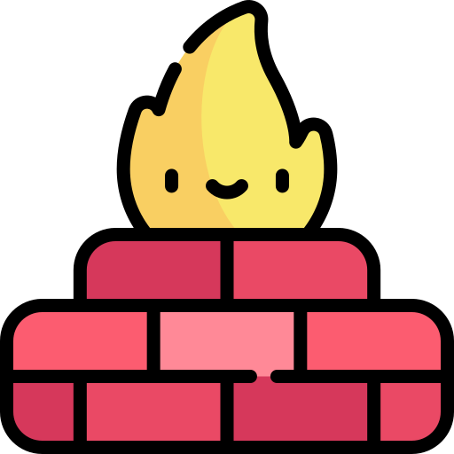
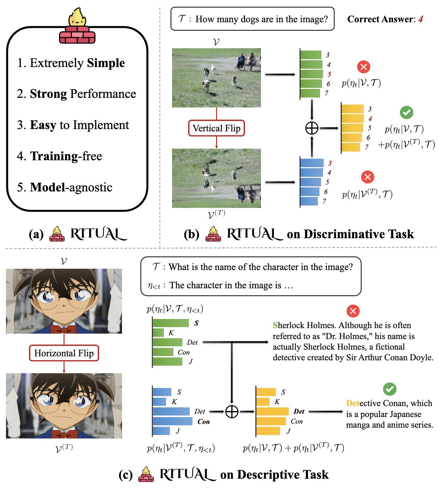
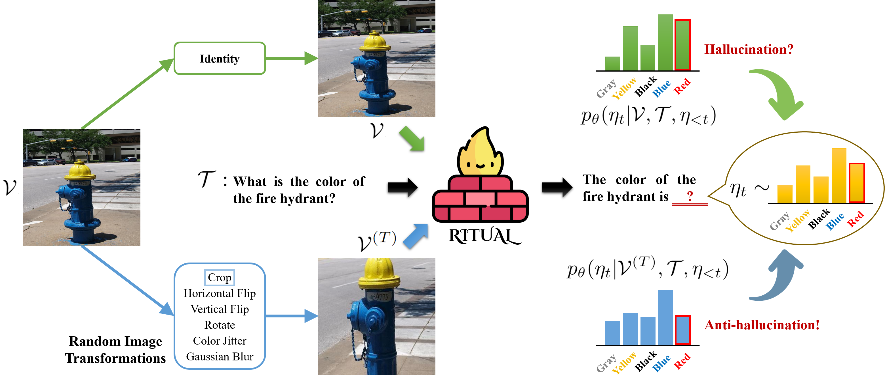
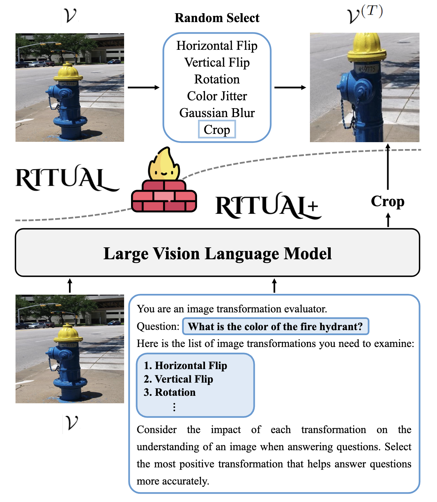
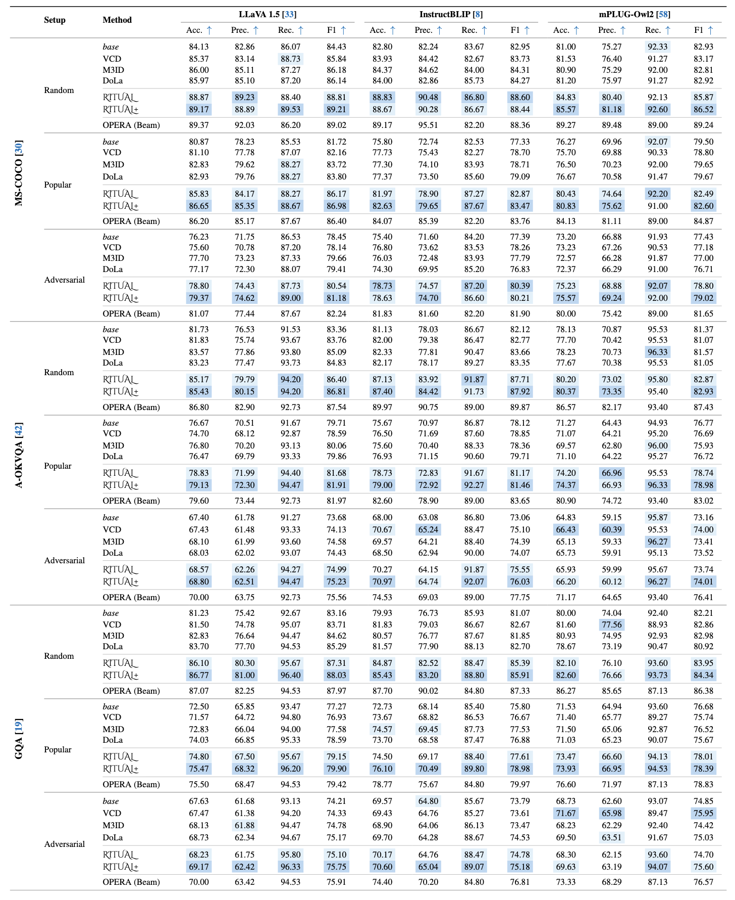
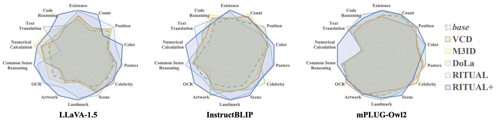
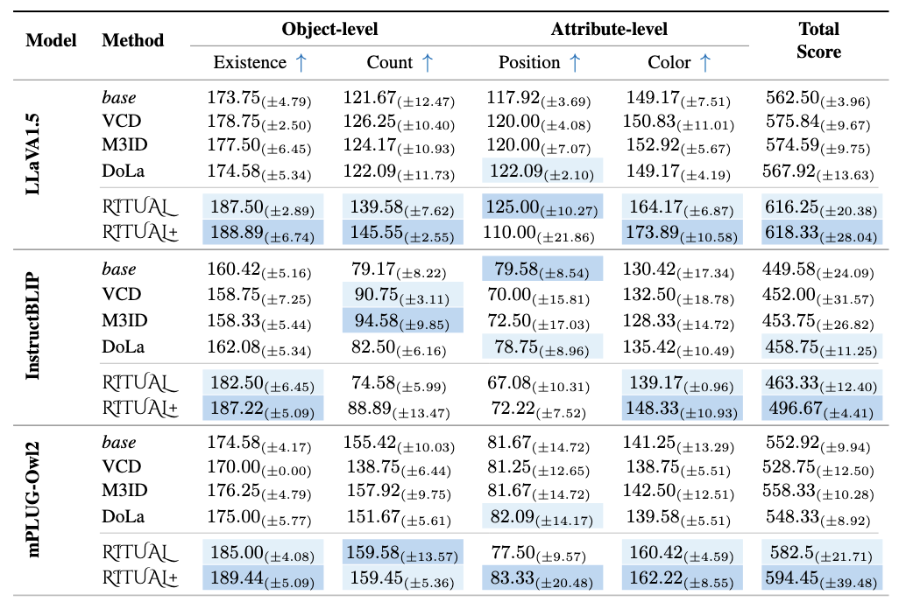
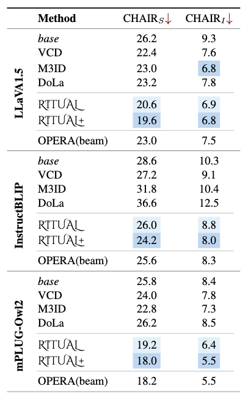
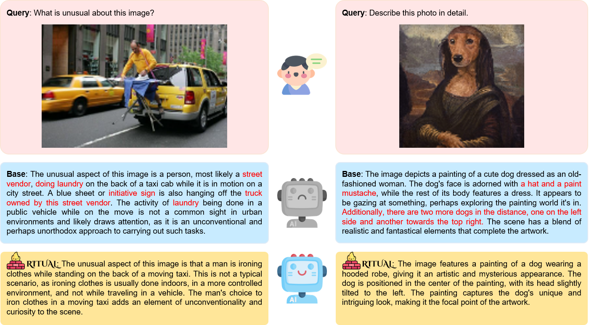
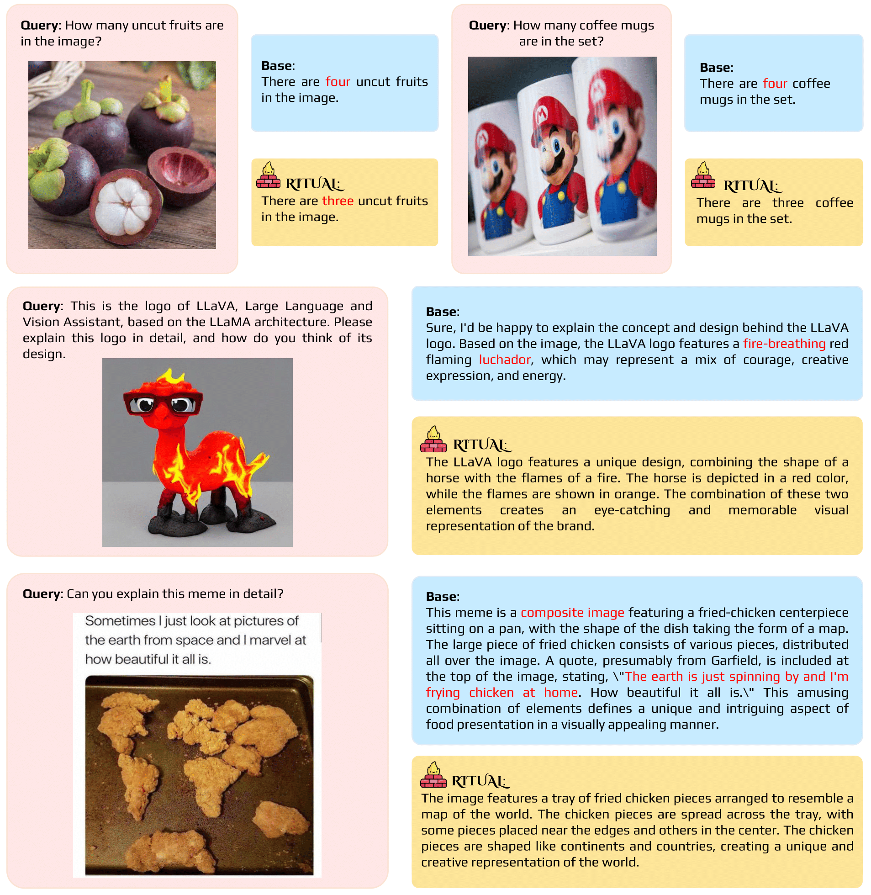

<p align="center" width="100%">

</p>


# 🔥 RITUAL: Random Image Transformations as a Universal Anti-hallucination Lever in Large Vision Language Models

<!-- Arxiv Link, Project Link -->
<div style='display:flex; gap: 0.25rem; '>
<a href="https://arxiv.org/abs/2405.17821"></a>
<a href="https://sangminwoo.github.io/RITUAL"></a>
<a href='LICENSE'></a>
</div>

This repository contains the official pytorch implementation of the paper: "RITUAL: Random Image Transformations as a Universal Anti-hallucination Lever in Large Vision Language Models".


## 🚨 Updates

 * **2024.12.16**: Update Paper / Project page
 * **2024.05.29**: Build project page
 * **2024.05.29**: RITUAL Paper online
 * **2024.05.28**: Code Release


## 👀 Overview
<p align="center" width="100%">

</p>

**TL;DR:** RITUAL is a simple yet effective anti-hallucination approach for LVLMs. Our RITUAL method leverages basic image transformations (e.g., vertical and horizontal flips) to enhance LVLM accuracy without external models or training. By integrating transformed and original images, RITUAL significantly reduces hallucinations in both discriminative tasks and descriptive tasks. Using both versions together enables the model to refine predictions, reducing errors and boosting correct responses.


## 🤖 RITUAL

<p align="center" width="100%">

</p>

When conditioned on the original image, the probabilities for Blue (correct) and Red (hallucinated) responses are similar, which can lead to the hallucinated response being easily sampled.
RITUAL leverages an additional probability distribution conditioned on the transformed image, where the likelihood of hallucination is significantly reduced.
Consequently, the response is sampled from a linear combination of the two probability distributions, ensuring more accurate and reliable outputs.


## RITUAL+
<p align="center" width="100%">

</p>

In **RITUAL**, the original image V undergoes random transformations, generating a transformed image. In **RITUAL+**, the model evaluates various potential transformations and selects the most beneficial one to improve answer accuracy within the given context, further refining reliability. These transformed images serve as complementary inputs, enabling the model to incorporate multiple visual perspectives to reduce hallucinations.


## 💻 Setup

```bash
conda create -n RITUAL python=3.10
conda activate RITUAL
git clone https://github.com/sangminwoo/RITUAL.git
cd RITUAL
pip install -r requirements.txt
```


## Models

*About model checkpoints preparation*
* [**LLaVA-1.5**](https://github.com/haotian-liu/LLaVA): Download [LLaVA-1.5 merged 7B](https://huggingface.co/liuhaotian/llava-v1.5-7b)
* [**InstructBLIP**](https://github.com/salesforce/LAVIS/tree/main/projects/instructblip): Download [InstructBLIP](https://huggingface.co/Salesforce/instructblip-vicuna-7b)


## 📊 Evaluation

* **POPE**: `bash eval_bench/scripts/pope_eval.sh` 
  - Need to specify "model", "model_path"
* **CHAIR**: `bash eval_bench/scripts/chair_eval.sh`
  - Need to specify "model", "model_path", "type"
* **MME**: `bash experiments/cd_scripts/mme_eval.sh`
  - Need to specify "model", "model_path"

*About datasets preparation*
- Please download and extract the MSCOCO 2014 dataset from [this link](https://cocodataset.org/) to your data path for evaluation.
- For MME evaluation, see [this link](https://github.com/BradyFU/Awesome-Multimodal-Large-Language-Models/tree/Evaluation).


## Results

⚠️ All baseline methods were reimplemented within our evaluation setup for fair comparison.

### POPE
<p align="center" width="100%">

</p>

### MME
**MME-Fullset**
<p align="center" width="100%">

</p>

**MME-Hallucination**
<p align="center" width="100%">

</p>

### CHAIR
<p align="center" width="100%">

</p>


## Examples

<p align="center" width="100%">

</p>

<p align="center" width="100%">

</p>


## 🙏 Acknowledgments
This codebase borrows from most notably [VCD](https://github.com/DAMO-NLP-SG/VCD), [OPERA](https://github.com/shikiw/OPERA), and [LLaVA](https://github.com/haotian-liu/LLaVA).
Many thanks to the authors for generously sharing their codes!


## 📝 Citation
If you find this repository helpful for your project, please consider citing our work :)

```
@article{woo2024ritual,
  title={RITUAL: Random Image Transformations as a Universal Anti-hallucination Lever in Large Vision Language Models}, 
  author={Woo, Sangmin and Jang, Jaehyuk and Kim, Donguk and Choi, Yubin and Kim, Changick},
  journal={arXiv preprint arXiv:2405.17821},
  year={2024},
}
```
